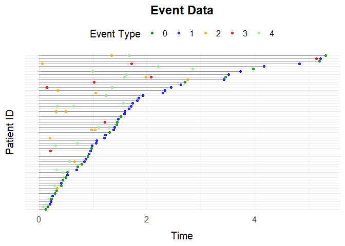
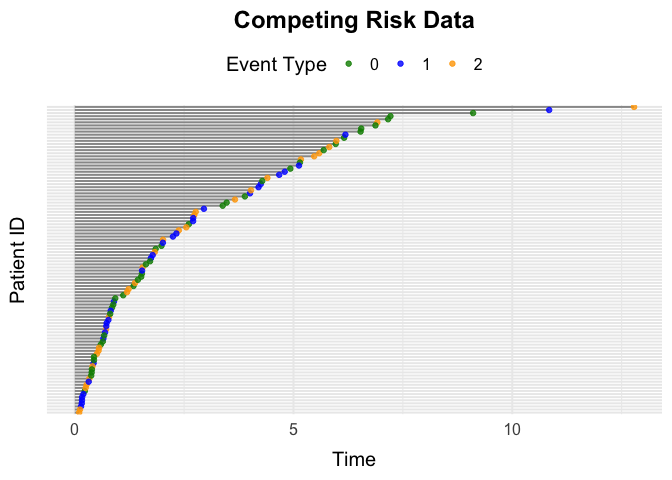
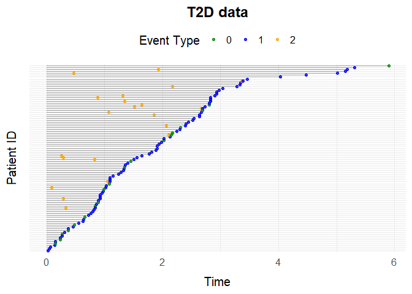

<!-- README.md is generated from README.Rmd. Please edit that file -->

# simevent

<!-- badges: start -->
<!-- badges: end -->

The goal of `simevent` is to provide functions for the generation and
analysis of complex continuous time health care data.

## Installation

You can install the development version of simevent from
[GitHub](https://github.com/) with:

``` r
# install.packages("pak")
pak::pak("miclukacova/simevent")
```

## Example 1: simEventData

This is an example of simulating data using `simEventData` from the
`sim_event` package. We load the package

``` r
library(simevent)
```

`simEventData` is a function for general event history simulations. The
function is quite flexible, and does therefore take many arguments. You
can read about the different arguments on the help page

``` r
?simEventData
```

The number of events simulated is determined by the length of the `eta`
vector, `nu` vector or the number of columns in the `beta` matrix. The
`beta` argument lets the user specify the effects of processes and
covariates on the intensities of the processes. We define a new beta
matrix. It has dimensions 9x5 since we simulate from a setting where we
have two baseline covariates, 5 processes and two additional baseline
covariates.

``` r
beta <- matrix(rnorm(9*5), ncol = 5, nrow = 9)
```

To include additional baseline covariates, the user can specify random
generator functions to generate the covariates. We will in the following
include two additional baseline covariates, one with a Bernoulli
distribution with success parameter 0.2, and one with a normal
distribution. The functions should take as input the number of draws to
make. We choose to specify two additional covariates by

``` r
# additional covariates
func1 <- function(N) rbinom(N, 1, 0.2)
func2 <- function(N) rnorm(N)
add_cov <- list(func1, func2)
```

One can specify an at_risk function

``` r
# at risk function
at_risk <- function(events) {
  return(c(
    1,1,                         # Always at risk for event 0 and 1
    as.numeric(events[3] < 2),   # Can experience event 2 twice
    as.numeric(events[4] < 1),   # Can experience event 3 once
    as.numeric(events[5] < 2)))  # Can experience event 4 twice
  }
```

This `at_risk` function for example, allows for recurrent events,
letting the individual event 2 and 4 twice. We use the default values of
$\eta$, $\nu$ and have no maximal censoring time. The `N` argument lets
the user specify number of individuals in the simulation. We simulate
data by the function call

``` r
set.seed(973)
data <- simEventData(N = 5000, beta = beta, add_cov = add_cov, at_risk = at_risk)
```

The simulated data looks like

``` r
head(data)
#> Key: <ID>
#>       ID      Time Delta        L0    A0    L1         L2    N0    N1    N2
#>    <int>     <num> <num>     <num> <int> <num>      <num> <num> <num> <num>
#> 1:     1  1.485037     1 0.0482511     1     0  0.9036369     0     0     0
#> 2:     2  1.438677     3 0.2186699     0     0  1.0631460     0     0     0
#> 3:     2  9.493541     2 0.2186699     0     0  1.0631460     0     0     0
#> 4:     2 12.358772     2 0.2186699     0     0  1.0631460     0     0     1
#> 5:     2 14.498814     0 0.2186699     0     0  1.0631460     0     0     2
#> 6:     3  3.391032     0 0.5021846     0     0 -0.2266280     0     0     0
#>       N3    N4
#>    <num> <num>
#> 1:     0     0
#> 2:     0     0
#> 3:     1     0
#> 4:     1     0
#> 5:     1     0
#> 6:     0     0
```

From data we can for example see that Individual $1$ has a baseline
covariate $L_0$ of $0.0482511$, does get baseline treatment ($A_0 = 1$)
and experienced the terminal event $0$ at Time $1.03$.

It could be of interest to estimate the effects of covariates on the
intensities of the different counting processes. A tool for this is the
Cox proportional hazards model. In order to fit a Cox proportional
hazards model with the `survival` package, the data needs to be
transformed into the so called format, this can be done by the function
`IntFormatData`.

``` r
data_int <- IntFormatData(data)
```

Data in the format looks like

``` r
head(data_int)
#> Key: <ID>
#>       ID      Time Delta        L0    A0    L1         L2    N0    N1    N2
#>    <int>     <num> <num>     <num> <int> <num>      <num> <num> <num> <num>
#> 1:     1  1.485037     1 0.0482511     1     0  0.9036369     0     0     0
#> 2:     2  1.438677     3 0.2186699     0     0  1.0631460     0     0     0
#> 3:     2  9.493541     2 0.2186699     0     0  1.0631460     0     0     0
#> 4:     2 12.358772     2 0.2186699     0     0  1.0631460     0     0     1
#> 5:     2 14.498814     0 0.2186699     0     0  1.0631460     0     0     2
#> 6:     3  3.391032     0 0.5021846     0     0 -0.2266280     0     0     0
#>       N3    N4     k    tstart     tstop
#>    <num> <num> <int>     <num>     <num>
#> 1:     0     0     1  0.000000  1.485037
#> 2:     0     0     1  0.000000  1.438677
#> 3:     1     0     2  1.438677  9.493541
#> 4:     1     0     3  9.493541 12.358772
#> 5:     1     0     4 12.358772 14.498814
#> 6:     0     0     1  0.000000  3.391032
```

The data contains the same information as the original data, only now
three additional columns have been added. The column *k*, indicates the
number of the event, the column *tstart* indicates the start of a time
interval, and the column *tstop* indicates the end of a time interval.
In each time interval the covariates (and processes) influencing the
intensities of the processes remain constant. Cox proportional hazards
models for the death process and operation process can be fitted by the
following code

``` r
library(survival)
# Process 0
survfit0 <- coxph(Surv(tstart, tstop, Delta == 0) ~ 
                    L0 + A0 + 
                    as.numeric(N2 > 0) +
                    as.numeric(N3 > 0) + 
                    as.numeric(N4 > 0) +
                    L1 + L2, 
                  data = data_int)

# Process 4
survfit4 <- coxph(Surv(tstart, tstop, Delta == 4) ~ L0 + A0 + 
                    as.numeric(N2 > 0) +
                    as.numeric(N3 > 0) + 
                    as.numeric(N4 > 0) +
                    L1 + L2, 
                  data = data_int[N4 < 2])
```

In order to conduct correct inference, only data where the individual is
at risk for the event in question is included in the regression. The
regression results can be seen by the summary call

One can visualize the data with use of the function `plotEventData`.

``` r
plotEventData(data[1:100,])
```

 The
plot shows the event history of the 100 first rows of data, the
different colors of the dots illustrate the different events. The
$x$-axis is the timeline.

## Example 2: Survival Data

A special case of the general setting is the survival setting, one can
simulate data from a survival setting with the function `simSurvData`.

``` r
data <- simSurvData(100)
plotEventData(data, title = "Survival Data")
```



One can again specify the effects of $A_0$ and $L_0$ on the risk of
death and censoring by the `beta` argument.

``` r
# No effect of L0 and A0 on censoring process
beta_C <- c(0,0)
# Effect of L0 and A0 on death process
beta_D <- c(1,-1)

beta <- cbind(beta_C, beta_D)
```

And specify the parameters of the Weibull intensity for the censoring
and death process.

``` r
eta <- c(0.2, 0.2)
nu <- c(1.05, 1.05)
```

We now call the function and visualize the data

``` r
data <- simSurvData(100, beta = beta, eta = eta, nu = nu)
plotEventData(data, title = "Survival Data")
```


## Example 3: Competing Risk Data

You can simulate data from a competing risk setting with the function
`simCRdata`. The arguments `beta`, `eta`, `nu`, work in a similar maner
as above.

``` r
data <- simCRdata(100)
plotEventData(data, title = "Competing Risk Data")
```



## Example 4: Type 2 Diabetes

The function `simT2D` simulates health care data from a setting where
patients can experience $3$ different events: Censoring (0), Death (1)
and Type-2-Diabetes (2). The various arguments allow for the different
scenarios, and you can read about them on the help page

``` r
?simT2D
```

Below is a function call to `simT2D`

``` r
data <- simT2D(N = 100,
               cens = 1,
               eta = c(0.1,0.3,0.1), 
               nu = c(1.1,1.3,1.1),
               beta_L0_L = 1, 
               beta_A0_L = -1.1, 
               beta_L_D = 1, 
               beta_L0_D = 0)

plotEventData(data, title = "T2D data")
```


## Example 5: Unobserved Covariate Setting

The `simConfounding` function was created to simulate data from a
setting where we have an unobserved confounding process. You can read
about the function on the help page

``` r
?simConfounding
```

One can simulate data from the default setting by the function call

``` r
data <- simConfounding(100)
```

And one can simulate from user specified scenarios by the function call

``` r
data <- simConfounding(N = 100,
                       beta_L_A = 1,
                       beta_L_D = 1,
                       beta_A_D = -1,
                       beta_A_L = -0.5,
                       beta_L0_A = 1,
                       eta = rep(0.1, 4),
                       nu = rep(1.1, 4),
                       followup = 5,
                       cens = 1,
                       op = 1)
```

For example the function call above simulates from a setting with the
operation/treatment event (op = 1), where there is a censoring process
(cens = 1), and where after 5 time units everybody is censored (followup
= 5). We can again visulize data by the function call to
`plotEventData`.

``` r
plotEventData(data, title = "Confounding setting")
```


