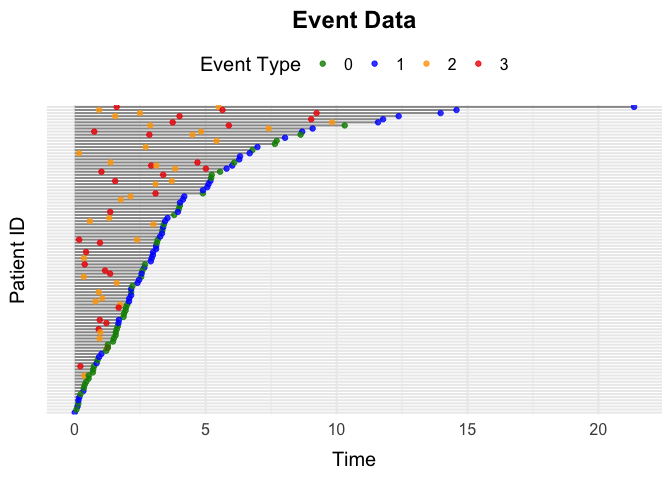

<!-- README.md is generated from README.Rmd. Please edit that file -->

# simevent

<!-- badges: start -->
<!-- badges: end -->

The goal of simevent is to provide functions for the generation and
analysis of complex continuous time health care data.

## Installation

You can install the development version of simevent from
[GitHub](https://github.com/) with:

``` r
# install.packages("pak")
pak::pak("miclukacova/simevent")
```

## Example 1: simEventData

The underlying function is called `simEventData`. One can specify
various arguments

``` r
library(simevent)
# Number of individuals
N <- 100
# Effect on event 0 
beta0 <- c(0, 0, 0, 0)
# Effect on event 1
beta1 <- c(1, -1, 1, -1)
# Effect on event 2 (A)
beta2 <- c(0, -1, 0, 0.5)
# Effect on event 3 (L)
beta3 <- c(0, 0, 1, 0)
beta <- cbind(beta0, beta1, beta2, beta3)
```

And then call the function

``` r
data <- simEventData(N = N, beta = beta)
```

The simulated data looks like

``` r
head(data)
#> Key: <ID>
#>       ID      Time Delta       L0     L    A0     A
#>    <int>     <num> <num>    <num> <num> <int> <num>
#> 1:     1 1.0487683     3 69.90414     0     0     0
#> 2:     1 1.0995389     1 69.90414     1     0     0
#> 3:     2 0.3579570     3 61.37030     0     0     0
#> 4:     2 1.1411689     1 61.37030     1     0     0
#> 5:     3 0.5415522     1 62.38574     0     0     0
#> 6:     4 1.1220836     0 32.82778     0     1     0
```

One can visualize the data by

``` r
plotEventData(data)
```



## Example 2: Survival Data

You can simulate data from a survival setting with the function
`simSurvData`.

``` r
data <- simSurvData(100)
plotEventData(data, title = "Survival Data")
```


## Example 3: Competing Risk Data

You can simulate data from a competing risk setting with the function
`simCRdata`.

``` r
data <- simCRdata(100)
plotEventData(data, title = "Competing Risk Data")
```


