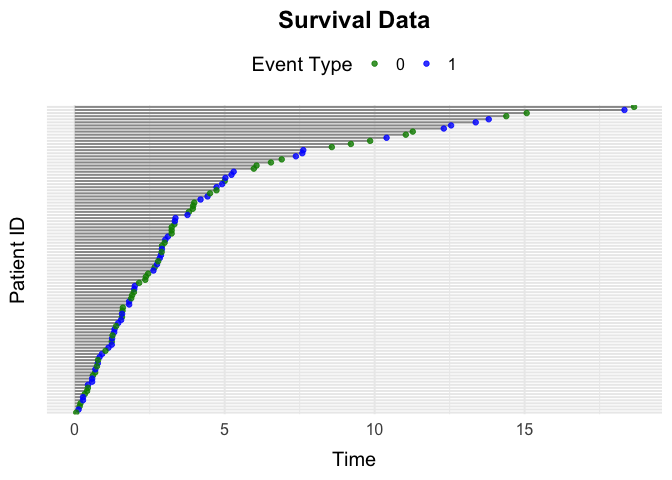
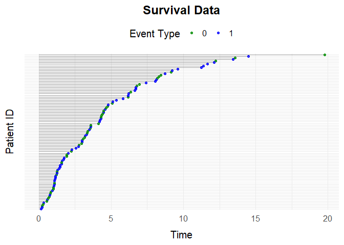

<!-- README.md is generated from README.Rmd. Please edit that file -->

# simevent

<!-- badges: start -->
<!-- badges: end -->

The goal of `simevent` is to provide functions for the generation and
analysis of complex continuous time health care data.

## Installation

You can install the development version of simevent from
[GitHub](https://github.com/) with:

``` r
# install.packages("pak")
pak::pak("miclukacova/simevent")
```

## Example 1: simEventData

We load the package

``` r
library(simevent)
```

The underlying function is called `simEventData`. One can specify
various arguments, as for example the `N` and `beta` argument. The
`N`argument lets the user specify number of individuals in the
simulation. The `beta` argument lets the user specify the effects of
processes and covariates on the intensities of the processes. We define
the various arguments

``` r
# Number of individuals
N <- 100
# Effect on event 0 
beta0 <- c(0, 0, 0, 0)
# Effect on event 1
beta1 <- c(1, -1, 1, -1)
# Effect on event 2 (A)
beta2 <- c(0, -1, 0, 0.5)
# Effect on event 3 (L)
beta3 <- c(0, 0, 1, 0)
beta <- cbind(beta0, beta1, beta2, beta3)
```

And then call the function

``` r
data <- simEventData(N = N, beta = beta)
```

The simulated data looks like

``` r
head(data)
#> Key: <ID>
#>       ID      Time Delta       L0     L    A0     A
#>    <int>     <num> <num>    <num> <num> <int> <num>
#> 1:     1 1.6487768     2 63.22484     0     1     0
#> 2:     1 9.2003661     1 63.22484     0     1     1
#> 3:     2 6.8472139     1 37.46308     0     1     0
#> 4:     3 0.3997357     1 62.58468     0     0     0
#> 5:     4 1.1660279     2 47.87919     0     1     0
#> 6:     4 2.5904808     1 47.87919     0     1     1
```

One can visualize the data by

``` r
plotEventData(data)
```


### Classical Estimation

We simulate for $N = 10^4$ individuals. Additional covariates

``` r
data <- simEventData(N = 10^4, beta = beta)
```

In order to fit a Cox proportional hazards model with the `survival`
package, the data needs to be transformed into the so called format,
this can be done by the function \`IntFormatData.\`\`\` Furthermore two
at risk indicators need to be created, one that indicates when the
individual is at risk for event $A$ and one that indicates that the
individual is at risk for event $L$.

``` r
data_int <- IntFormatData(data)
data_int[, at_risk_2 := as.numeric(A == 0)]
data_int[, at_risk_3 := as.numeric(L == 0)]
```

Data in the format looks like

``` r
head(data_int)
#> Key: <ID>
#>       ID      Time Delta       L0     L    A0     A     k   tstart     tstop
#>    <int>     <num> <num>    <num> <num> <int> <num> <int>    <num>     <num>
#> 1:     1 2.0373085     3 50.92628     0     0     0     1 0.000000 2.0373085
#> 2:     1 3.6342119     1 50.92628     1     0     0     2 2.037309 3.6342119
#> 3:     2 1.6753524     0 42.96036     0     1     0     1 0.000000 1.6753524
#> 4:     3 1.1853940     1 30.72762     0     1     0     1 0.000000 1.1853940
#> 5:     4 3.1342088     0 57.44008     0     1     0     1 0.000000 3.1342088
#> 6:     5 0.7731562     1 46.84456     0     1     0     1 0.000000 0.7731562
#>    at_risk_2 at_risk_3
#>        <num>     <num>
#> 1:         1         1
#> 2:         1         0
#> 3:         1         1
#> 4:         1         1
#> 5:         1         1
#> 6:         1         1
```

Cox proportional hazards models for the death process and operation
process can be fitted by the following code

``` r
library(survival)
# Death process
survfit_death <- coxph(Surv(tstart, tstop, Delta == 1) ~ I(L0/50) + A0 + L + A, 
                       data = data_int)
# Operation process
survfit_oper <- coxph(Surv(tstart, tstop, Delta == 2) ~ I(L0/50) + A0 + L, 
                      data = data_int[at_risk_2 == 1])
```

The regression results can be seen by the summary call

``` r
survfit_death |> summary()
#> Call:
#> coxph(formula = Surv(tstart, tstop, Delta == 1) ~ I(L0/50) + 
#>     A0 + L + A, data = data_int)
#> 
#>   n= 14461, number of events= 6352 
#> 
#>              coef exp(coef) se(coef)      z Pr(>|z|)    
#> I(L0/50)  0.98586   2.68011  0.05546  17.78   <2e-16 ***
#> A0       -1.00430   0.36630  0.02715 -36.99   <2e-16 ***
#> L         0.97273   2.64517  0.02946  33.02   <2e-16 ***
#> A        -1.02780   0.35779  0.04316 -23.81   <2e-16 ***
#> ---
#> Signif. codes:  0 '***' 0.001 '**' 0.01 '*' 0.05 '.' 0.1 ' ' 1
#> 
#>          exp(coef) exp(-coef) lower .95 upper .95
#> I(L0/50)    2.6801     0.3731    2.4041    2.9878
#> A0          0.3663     2.7300    0.3473    0.3863
#> L           2.6452     0.3780    2.4968    2.8024
#> A           0.3578     2.7949    0.3288    0.3894
#> 
#> Concordance= 0.676  (se = 0.004 )
#> Likelihood ratio test= 2719  on 4 df,   p=<2e-16
#> Wald test            = 2698  on 4 df,   p=<2e-16
#> Score (logrank) test = 2799  on 4 df,   p=<2e-16
```

## Example 2: Survival Data

You can simulate data from a survival setting with the function
`simSurvData`.

``` r
data <- simSurvData(100)
plotEventData(data, title = "Survival Data")
```



One can again specify the effects of $A_0$ and $L_0$ on the risk of
death and censoring by the `beta` argument.

``` r
# No effect of L0 and A0 on censoring process
beta_C <- c(0,0)
# Effect of L0 and A0 on death process
beta_D <- c(1,-1)

beta <- cbind(beta_C, beta_D)
```

And specify the parameters of the Weibull intensity for the censoring
and death process.

``` r
eta <- c(0.2, 0.2)
nu <- c(1.05, 1.05)
```

We now call the function and visualize the data

``` r
data <- simSurvData(100, beta = beta, eta = eta, nu = nu)
plotEventData(data, title = "Survival Data")
```


## Example 3: Competing Risk Data

You can simulate data from a competing risk setting with the function
`simCRdata`. The arguments `beta`, `eta`, `nu`, work in a similar maner
as above.

``` r
data <- simCRdata(100)
plotEventData(data, title = "Competing Risk Data")
```


## Example 4: Type 2 Diabetes

The function `simT2D` simulates health care data from a setting where
patients can experience $3$ different events: Censoring (0), Death (1)
and Type-2-Diabetes (2). The various arguments allow for the different
scenarios, and you can read about them on the help page

``` r
?simT2D
```

Below is a function call to `simT2D`

``` r
data <- simT2D(N = 100,
               sex = FALSE, 
               cens = 1,
               eta = c(0.1,0.3,0.1,0.1), 
               nu = c(1.1,1.3,1.1,1.1),
               beta_L0_L = 1, 
               beta_A0_L = -1.1, 
               beta_L_D = 1, 
               beta_L0_D = 0)

plotEventData(data, title = "T2D data")
```



## Example 5: Unobserved Covariate Setting

The `simConfounding` function was created to simulate data from a
setting where we have an unobserved confounding process. You can read
about the function on the help page

``` r
?simConfounding
```

One can simulate data from the default setting by the function call

``` r
data <- simConfounding(100)
```

And one can simulate from user specified scenarios by the function call

``` r
data <- simConfounding(N = 100,
                       beta_L_A = 1,
                       beta_L_D = 1,
                       beta_A_D = -1,
                       beta_A_L = -0.5,
                       beta_L0_A = 1,
                       eta = rep(0.1, 4),
                       nu = rep(1.1, 4),
                       followup = 5,
                       cens = 1,
                       op = 1)
```

For example the function call above simulates from a setting with the
operation/treatment event (op = 1), where there is a censoring process
(cens = 1), and where after 5 time units everybody is censored (followup
= 5). We can again visulize data by the function call to
`plotEventData`.

``` r
plotEventData(data, title = "Confounding setting")
```


