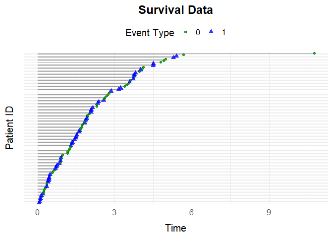
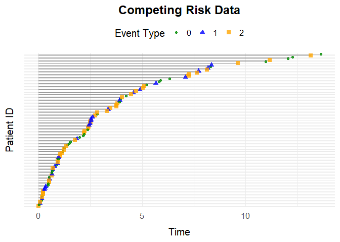

<!-- README.md is generated from README.Rmd. Please edit that file -->

# simevent

<!-- badges: start -->
<!-- badges: end -->

The goal of `simevent` is to provide functions for the generation and
analysis of complex continuous time health care data.

## Installation

You can install the development version of simevent from
[GitHub](https://github.com/) with:

``` r
# install.packages("pak")
pak::pak("miclukacova/simevent")
```

## Example 1: simEventData

We load the package

``` r
library(simevent)
```

This is an example of simulating using `simEventData`. The `N` argument
lets the user specify number of individuals in the simulation. We can
simulate observational health care data for 100 individuals with the
function call

``` r
set.seed(2112)
data <- simEventData(N = 100)
```

The simulated data looks like

``` r
head(data)
#> Key: <ID>
#>       ID      Time Delta       L0     L    A0     A
#>    <int>     <num> <num>    <num> <num> <int> <num>
#> 1:     1 2.9037787     1 62.89378     0     0     0
#> 2:     2 0.7063947     0 49.09138     0     1     0
#> 3:     3 7.6447085     0 45.16921     0     1     0
#> 4:     4 2.6600085     1 40.66332     0     1     0
#> 5:     5 0.9501756     2 40.62088     0     0     0
#> 6:     5 1.4929627     0 40.62088     0     0     1
```

From data we can for example see that Individual $1$ has a baseline
covariate $L_0$ of $62.89$, does not get treatment ($A_0 = 0$) and
experienced the terminal event $1$ at Time $2.9$. One can visualize the
data with use of the function `plotEventData`

``` r
plotEventData(data)
```


The plot shows the event history of the $N = 100$ individuals, the
different colors of the dots illustrate the different events. The
$x$-axis is the timeline.

### Arguments of simEventData

`simEventData` is quite flexible, and does therefore take many
arguments. You can read about the different arguments on the help page

``` r
?simEventData
```

To include additional baseline covariates, the user can specify random
generator functions to generate the covariates. We will in the following
include to additional baseline covariates, one with a bernoulli
distribution with succes parameter 0.2, and one with a normal
distribution. The functions should take as input the number of draws to
make.

``` r
func1 <- function(N) rbinom(N, 1, 0.2)
func2 <- function(N) rnorm(N)
add_cov <- list(func1, func2)
```

The `beta` argument lets the user specify the effects of processes and
covariates on the intensities of the processes. We define a new beta
matrix, it should have dimensions 6x4 since we have two additional
baseline covariates.

``` r
# Effect on event 0 
beta0 <- c(0, 0, 0, 0, 0, 0)
# Effect on event 1
beta1 <- c(1, -1, 1, -1, -1, -1)
# Effect on event 2 (A)
beta2 <- c(0, -1, 0, 0.5, 0.5, 0)
# Effect on event 3 (L)
beta3 <- c(0, 0, 1, 0, 0, 0)
beta <- cbind(beta0, beta1, beta2, beta3)
```

We can specify a user defined `at_risk` function by

``` r
at_risk <- function(i, L, A) {
  return(c(
    1,1,                      # You are always at risk for death and censoring
    as.numeric(A[i] == 0),    # You can experience A once
    as.numeric(L[i] < 2)))    # You can experience L twice
  }
```

This `at_risk` function for example, allows for recurrent events,
letting the individual experience the $L$ event twice. We simulate data
from this setting, and use the default values of $\eta$, $\nu$ and have
no maximal censoring time.

``` r
data <- simEventData(N = 100, add_cov = add_cov, beta = beta, at_risk = at_risk)
```

The additional covariates are called $L_1$ and $L_2$, and data now looks
like

``` r
head(data)
#> Key: <ID>
#>       ID      Time Delta       L0     L    A0     A    L1         L2
#>    <int>     <num> <num>    <num> <num> <int> <num> <num>      <num>
#> 1:     1 1.5590413     1 49.79150     0     1     0     0 -0.1052511
#> 2:     2 3.5675446     1 35.22123     0     1     0     0 -1.2947378
#> 3:     3 2.0755969     0 61.12498     0     1     0     0  1.3408939
#> 4:     4 0.4407033     1 54.78982     0     0     0     0 -1.3608400
#> 5:     5 0.8704168     0 46.70442     0     1     0     1  0.2032149
#> 6:     6 0.0871322     0 59.68767     0     1     0     1  0.1238069
```

### Cox Regression

It could be of interest to estimate the effects of covariates on the
intensities of the different counting processes. A tool for this is the
Cox proportional hazards model. We start by simulating data for
$N = 10^4$ individuals.

``` r
data <- simEventData(N = 10^4, beta = beta)
```

In order to fit a Cox proportional hazards model with the `survival`
package, the data needs to be transformed into the so called format,
this can be done by the function `IntFormatData`.

``` r
data_int <- IntFormatData(data)
```

Data in the format looks like

``` r
head(data_int)
#> Key: <ID>
#>       ID      Time Delta       L0     L    A0     A     k   tstart     tstop
#>    <int>     <num> <num>    <num> <num> <int> <num> <int>    <num>     <num>
#> 1:     1 0.2803617     1 56.28101     0     0     0     1 0.000000 0.2803617
#> 2:     2 2.1744307     0 42.91979     0     1     0     1 0.000000 2.1744307
#> 3:     3 1.5787315     3 65.45872     0     0     0     1 0.000000 1.5787315
#> 4:     3 1.8758636     1 65.45872     1     0     0     2 1.578732 1.8758636
#> 5:     4 1.0141196     1 32.28017     0     1     0     1 0.000000 1.0141196
#> 6:     5 2.5035652     1 54.97065     0     1     0     1 0.000000 2.5035652
```

The data contains the same information as the original data, only now
three additional columns have been added. The column *k*, indicates the
number of the event, the column *tstart* indicates the start of a time
interval, and the column *tstop* indicates the end of a time interval.
In each time interval the covariates (and processes) influencing the
intensities of the processes remain constant. Cox proportional hazards
models for the death process and operation process can be fitted by the
following code

``` r
library(survival)
# Death process
survfit_death <- coxph(Surv(tstart, tstop, Delta == 1) ~ I(L0/50) + A0 + L + A, 
                       data = data_int)
# Operation process
survfit_oper <- coxph(Surv(tstart, tstop, Delta == 2) ~ I(L0/50) + A0 + L, 
                      data = data_int[A == 0])
```

In order to conduct correct inference, only data where the individual is
at risk for the event in question is included in the regression. The
regression results can be seen by the summary call

``` r
survfit_death |> summary()
#> Call:
#> coxph(formula = Surv(tstart, tstop, Delta == 1) ~ I(L0/50) + 
#>     A0 + L + A, data = data_int)
#> 
#>   n= 14481, number of events= 6367 
#> 
#>              coef exp(coef) se(coef)      z Pr(>|z|)    
#> I(L0/50)  0.90118   2.46250  0.05499  16.39   <2e-16 ***
#> A0       -0.97200   0.37832  0.02708 -35.89   <2e-16 ***
#> L         0.96847   2.63392  0.02921  33.16   <2e-16 ***
#> A        -0.96298   0.38175  0.04133 -23.30   <2e-16 ***
#> ---
#> Signif. codes:  0 '***' 0.001 '**' 0.01 '*' 0.05 '.' 0.1 ' ' 1
#> 
#>          exp(coef) exp(-coef) lower .95 upper .95
#> I(L0/50)    2.4625     0.4061    2.2109    2.7428
#> A0          0.3783     2.6432    0.3588    0.3989
#> L           2.6339     0.3797    2.4874    2.7891
#> A           0.3818     2.6195    0.3521    0.4140
#> 
#> Concordance= 0.669  (se = 0.004 )
#> Likelihood ratio test= 2593  on 4 df,   p=<2e-16
#> Wald test            = 2589  on 4 df,   p=<2e-16
#> Score (logrank) test = 2680  on 4 df,   p=<2e-16
```

## Example 2: Survival Data

A special case of the general setting is the survival setting, one can
simulate data from a survival setting with the function `simSurvData`.

``` r
data <- simSurvData(100)
plotEventData(data, title = "Survival Data")
```


One can again specify the effects of $A_0$ and $L_0$ on the risk of
death and censoring by the `beta` argument.

``` r
# No effect of L0 and A0 on censoring process
beta_C <- c(0,0)
# Effect of L0 and A0 on death process
beta_D <- c(1,-1)

beta <- cbind(beta_C, beta_D)
```

And specify the parameters of the Weibull intensity for the censoring
and death process.

``` r
eta <- c(0.2, 0.2)
nu <- c(1.05, 1.05)
```

We now call the function and visualize the data

``` r
data <- simSurvData(100, beta = beta, eta = eta, nu = nu)
plotEventData(data, title = "Survival Data")
```



## Example 3: Competing Risk Data

You can simulate data from a competing risk setting with the function
`simCRdata`. The arguments `beta`, `eta`, `nu`, work in a similar maner
as above.

``` r
data <- simCRdata(100)
plotEventData(data, title = "Competing Risk Data")
```


## Example 4: Type 2 Diabetes

The function `simT2D` simulates health care data from a setting where
patients can experience $3$ different events: Censoring (0), Death (1)
and Type-2-Diabetes (2). The various arguments allow for the different
scenarios, and you can read about them on the help page

``` r
?simT2D
```

Below is a function call to `simT2D`

``` r
data <- simT2D(N = 100,
               cens = 1,
               eta = c(0.1,0.3,0.1,0.1), 
               nu = c(1.1,1.3,1.1,1.1),
               beta_L0_L = 1, 
               beta_A0_L = -1.1, 
               beta_L_D = 1, 
               beta_L0_D = 0)

plotEventData(data, title = "T2D data")
```



## Example 5: Unobserved Covariate Setting

The `simConfounding` function was created to simulate data from a
setting where we have an unobserved confounding process. You can read
about the function on the help page

``` r
?simConfounding
```

One can simulate data from the default setting by the function call

``` r
data <- simConfounding(100)
```

And one can simulate from user specified scenarios by the function call

``` r
data <- simConfounding(N = 100,
                       beta_L_A = 1,
                       beta_L_D = 1,
                       beta_A_D = -1,
                       beta_A_L = -0.5,
                       beta_L0_A = 1,
                       eta = rep(0.1, 4),
                       nu = rep(1.1, 4),
                       followup = 5,
                       cens = 1,
                       op = 1)
```

For example the function call above simulates from a setting with the
operation/treatment event (op = 1), where there is a censoring process
(cens = 1), and where after 5 time units everybody is censored (followup
= 5). We can again visulize data by the function call to
`plotEventData`.

``` r
plotEventData(data, title = "Confounding setting")
```


## Example 0: simEventData2

`simEventData2` is a function for more generel event history
simulations. The structure and the arguments of the function resemble
`simEventData`. The number of events simulated is determined by the
length of the `eta` vector, `nu` vector or the number of columns in the
`beta` matrix. We specify the beta matrix as

``` r
beta <- matrix(rnorm(8*5), ncol = 5, nrow = 8)
```

We choose to specify to additional covariates by

``` r
# additional covariates
func1 <- function(N) rbinom(N, 1, 0.2)
func2 <- function(N) rnorm(N)
add_cov <- list(func1, func2)
```

And choose the following at risk function

``` r
# at risk function
at_risk <- function(i, event_counts) {
  return(c(
    1,1,                                  # Always at risk for event 0 and 1
    as.numeric(event_counts[i, 3] < 2),   # Can experience event 2 twice
    as.numeric(event_counts[i, 4] < 1),   # Can experience event 3 once
    as.numeric(event_counts[i, 5] < 2)))  # Can experience event 4 twice
  }
```

We simulate data by the function call

``` r
set.seed(973)
data <- simEventData2(N = 10000, beta = beta, add_cov = add_cov, at_risk = at_risk)
```

Transform data

``` r
data_int <- IntFormatData(data)
```

Fitting models

``` r
library(survival)
# Process 0
survfit0 <- coxph(Surv(tstart, tstop, Delta == 0) ~ L0 + A0 + N2 + N3 + N4 + L1 + L2, 
                       data = data_int)
beta[,1]
#> [1] -1.22372961 -1.20478832 -0.52291798 -0.47604546 -0.04600557 -0.03706302
#> [7] -1.37328309 -0.23148483
# Process 4
survfit4 <- coxph(Surv(tstart, tstop, Delta == 4) ~ L0 + A0 + N2 + N3 + N4 + L1 + L2,
                      data = data_int[N4 < 2])
#> Warning in agreg.fit(X, Y, istrat, offset, init, control, weights = weights, :
#> Loglik converged before variable 5 ; beta may be infinite.
beta[,4]
#> [1] -0.45118452  0.53396282 -0.58447914 -1.45004733  0.79063918  0.31987884
#> [7] -0.44942142 -0.07501029
```

Plotting data

``` r
plotEventData(data[1:100,])
```


