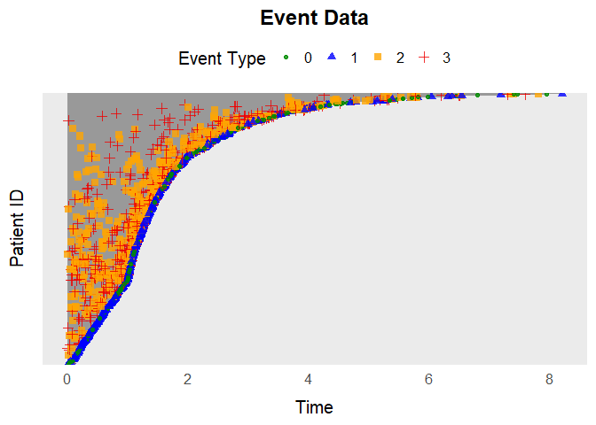

The simevent package
================

- [simevent](#simevent)
  - [Installation](#installation)
  - [Usage](#usage)
    - [Example 1: General Event History Simulation with
      `simEventData`](#example-1-general-event-history-simulation-with-simeventdata)
    - [Formatting Data for Cox
      Regression](#formatting-data-for-cox-regression)
    - [Visualize Event Histories](#visualize-event-histories)
    - [Using override_beta](#using-override_beta)
  - [Example 2: Survival Data with
    `simSurvData`](#example-2-survival-data-with-simsurvdata)
  - [Example 3: Competing Risk Data with
    `simCRdata`](#example-3-competing-risk-data-with-simcrdata)
  - [Example 4: Health Care Data with
    `simDisease`](#example-4-health-care-data-with-simdisease)
  - [Example 5: Health Care Data with
    `simTreatment`](#example-5-health-care-data-with-simtreatment)
  - [Example 5: Time Varying Effects with
    `simEventTV`](#example-5-time-varying-effects-with-simeventtv)

# simevent

<!-- badges: start -->

<!-- badges: end -->

The `simevent` package provides tools for simulating and analyzing
complex continuous-time health care data.The simulated data includes
variables that can be interpreted as treatment decisions, disease
progression, and health factors.

At its core is the flexible function `simEventData`, which simulates
from a Cox proportional hazards model with Weibull hazards. Users can
specify parameters and covariate effects to create custom scenarios.

In addition, the package offers several wrapper functions for common
settings (e.g., survival data, competing risks) built on top of
`simEventData.` It also includes functions for plotting
(`plotEventData`), formatting (`IntFormatData`), and simulating
interventions (e.g., `intEffectAlphaDisease`).

## Installation

You can install the development version of `simevent` from
[GitHub](https://github.com/) with:

``` r
# install.packages("pak")
pak::pak("miclukacova/simevent")
```

## Usage

The package is loaded with the command

``` r
library(simevent)
```

### Example 1: General Event History Simulation with `simEventData`

This is an example of simulating data using
`simEventData`.`simEventData` is a function for general event history
simulations. The function is quite flexible, and does therefore take
many arguments. You can read about the different arguments on the help
page

``` r
?simEventData
```

The number of simulated events corresponds to the length of the vectors
, , or the number of columns in .

Below, we create a 9x5 beta matrix for 5 event processes and 4 baseline
covariates:

``` r
set.seed(736)
beta <- matrix(rnorm(9*5), ncol = 5, nrow = 9)
```

You can add baseline covariates by supplying generator functions:

``` r
func1 <- function(N) rbinom(N, 1, 0.2)
func2 <- function(N) rnorm(N)
add_cov <- list("Z1" = func1, "Z2" = func2)
```

Define an function to specify risk windows for recurrent events:

``` r
# at risk function
at_risk <- function(events) {
  return(c(
    1,1,                         # Always at risk for event 0 and 1
    as.numeric(events[3] < 2),   # Event 2 can occur twice
    as.numeric(events[4] < 1),   # Event 3 can occur once
    as.numeric(events[5] < 2)))  # Event 4 can occur twice
}
```

Optionally one can define an function to specify risk windows as a
function of covariates:

``` r
# at risk function
at_risk_cov <- function(covariates) {
  return(c(
    1,1,                               # The covariates do not change the risk of event 1 and 2
    as.numeric(covariates[1] < 0.5),   # Only at risk of event 3 if L0 < 0.5
    as.numeric(covariates[2] == 1),    # Only at risk of event 4 if A0 = 1
    1))                                # The covariates do not change the risk of event 4
}
```

Simulate data for 5000 individuals:

``` r
set.seed(973)
data <- simEventData(N = 5000, beta = beta, add_cov = add_cov, at_risk = at_risk, at_risk_cov = at_risk_cov)
```

Preview the simulated data:

``` r
head(data)
#> Key: <ID>
#>       ID      Time Delta        L0    A0    Z1         Z2    N0    N1    N2
#>    <int>     <num> <int>     <num> <num> <num>      <num> <num> <num> <num>
#> 1:     1 0.5067418     4 0.0482511     1     0  0.9036369     0     0     0
#> 2:     1 0.7741479     0 0.0482511     1     0  0.9036369     1     0     0
#> 3:     2 0.7952969     1 0.2186699     0     0  1.0631460     0     1     0
#> 4:     3 4.3490086     1 0.5021846     0     0 -0.2266280     0     1     0
#> 5:     4 0.1689083     0 0.4053148     1     0  1.2534397     1     0     0
#> 6:     5 1.5183445     3 0.3986500     1     0 -0.9204445     0     0     0
#>       N3    N4
#>    <num> <num>
#> 1:     0     1
#> 2:     0     1
#> 3:     0     0
#> 4:     0     0
#> 5:     0     0
#> 6:     1     0
```

### Formatting Data for Cox Regression

Transform the data into *tstart-tstop* format with `IntFormatData`
(specify columns with counting process data):

``` r
data_int <- IntFormatData(data, N_cols = 8:12)
head(data_int)
#>       ID      Time Delta        L0    A0    Z1         Z2    N0    N1    N2
#>    <int>     <num> <int>     <num> <num> <num>      <num> <num> <num> <num>
#> 1:     1 0.5067418     4 0.0482511     1     0  0.9036369     0     0     0
#> 2:     1 0.7741479     0 0.0482511     1     0  0.9036369     0     0     0
#> 3:     2 0.7952969     1 0.2186699     0     0  1.0631460     0     0     0
#> 4:     3 4.3490086     1 0.5021846     0     0 -0.2266280     0     0     0
#> 5:     4 0.1689083     0 0.4053148     1     0  1.2534397     0     0     0
#> 6:     5 1.5183445     3 0.3986500     1     0 -0.9204445     0     0     0
#>       N3    N4     k    tstart     tstop
#>    <num> <num> <int>     <num>     <num>
#> 1:     0     0     1 0.0000000 0.5067418
#> 2:     0     1     2 0.5067418 0.7741479
#> 3:     0     0     1 0.0000000 0.7952969
#> 4:     0     0     1 0.0000000 4.3490086
#> 5:     0     0     1 0.0000000 0.1689083
#> 6:     0     0     1 0.0000000 1.5183445
```

Fit Cox models for processes 0 and 4:

``` r
library(survival)

# Process 0
survfit0 <- coxph(Surv(tstart, tstop, Delta == 0) ~ L0 + A0 + Z1 + Z2 + N2 + N3 + N4, 
                  data = data_int)

# Process 4
survfit4 <- coxph(Surv(tstart, tstop, Delta == 4) ~ L0 + Z1 + Z2 + N2 + N3 + N4, 
                  data = data_int[(N4 < 2) & (A0 == 1)])
```

Visualize estimated coefficients alongside true values:

``` r
CIs <- cbind("Par" = c(paste0(rownames(confint(survfit0)), "_N0"), 
                       paste0(rownames(confint(survfit4)), "_N4")), 
             rbind(confint(survfit0), confint(survfit4)))

rownames(CIs) <- NULL
colnames(CIs) <- c("Par", "Lower", "Upper")
CIs <- data.table(CIs)
CIs[, True_val := c(beta[-c(5,6),1],
                    beta[-c(2,5,6),5])]

CIs$Lower <- as.numeric(CIs$Lower)
CIs$Upper <- as.numeric(CIs$Upper)

pp <- ggplot(data = CIs)+
  geom_point(aes(y = Par, x = Lower))+
  geom_point(aes(y = Par, x = Upper))+
  geom_point(aes(y = Par, x = True_val, col = "Estimate"))+
  scale_color_manual(values = c("Estimate" = "red"))+
  geom_segment(aes(y = Par, yend = Par, x = Lower, xend = Upper))+
  xlab("Estimates")
pp
```


### Visualize Event Histories

Plot the first 100 individuals’ event histories:

``` r
plotEventData(data[1:100,])
```


### Using override_beta

You can override specific entries in the beta matrix. For example, set
the effect of on processes and to zero:

``` r
data <- simEventData(N = 1000, beta = beta, add_cov = add_cov, at_risk = at_risk,
                     override_beta = list("L0" = c("N0" = 0, "N1" = 0)))
```

You can also specify non-linear effects, e.g., effect of on set to zero
if :

``` r
data <- simEventData(N = 1000, beta = beta, add_cov = add_cov, at_risk = at_risk,
                     override_beta = list("N2 > 1" = c("N1" = 2)))
```

Additionally the argument can be used to specify interaction effects,
e.g., if we want an interaction effect of 1 between L0 and N1 on N2 we
can specify the argument:

``` r
data <- simEventData(N = 1000, beta = beta, add_cov = add_cov, at_risk = at_risk,
                     override_beta =list("L0 * N1" = c("N2" = 1)))
```

## Example 2: Survival Data with `simSurvData`

The function simSurvData allows you to simulate survival data for
individuals at risk of both censoring (0) and an event (1).

By default, the function simulates survival data with no covariate
effects:

``` r
data <- simSurvData(100)
plotEventData(data, title = "Survival Data")
```


You can specify how baseline covariates and affect the risk of censoring
and death through the matrix. For example:

``` r
# Effects of L0 and A0 on the censoring hazard (first column)
beta_C <- c(0, 0)  

# Effects of L0 and A0 on the death hazard (second column)
beta_D <- c(1, -1)

# Combine into a 2x2 matrix where columns represent censoring and death hazards
beta <- cbind(beta_C, beta_D)
```

You can also set the Weibull shape () and scale () parameters for both
censoring and death hazards:

``` r
eta <- c(0.2, 0.2)
nu <- c(1.05, 1.05)
```

Use the specified parameters to simulate data and visualize it:

``` r
data <- simSurvData(100, beta = beta, eta = eta, nu = nu)
plotEventData(data, title = "Survival Data")
```


## Example 3: Competing Risk Data with `simCRdata`

Simulate competing risk data (similar parameters as above):

``` r
data <- simCRdata(100)
plotEventData(data, title = "Competing Risk Data")
```


## Example 4: Health Care Data with `simDisease`

The function `simDisease` simulates health care data from a setting
where patients can experience $3$ different events: \* **Censoring**
(coded as 0) \* **Death** (coded as 1), and \* **Disease** (coded as 2).

You can customize the simulation scenarios by adjusting the function
arguments. For detailed information about the parameters, see the help
page:

``` r
?simDisease
```

Example simulation

``` r
data <- simDisease(N = 100,
               cens = 1,
               eta = c(0.1,0.3,0.1), 
               nu = c(1.1,1.3,1.1),
               beta_L0_L = 1, 
               beta_A0_L = -1.1, 
               beta_L_D = 1, 
               beta_L0_D = 0)

plotEventData(data, title = "Disease data")
```


## Example 5: Health Care Data with `simTreatment`

Simulate data with a covariate process and treatment process:

``` r
?simTreatment
```

Default simulation:

``` r
data <- simTreatment(100)
```

Custom scenario:

``` r
data <- simTreatment(N = 100,
                       beta_L_A = 1,
                       beta_L_D = 1,
                       beta_A_D = -1,
                       beta_A_L = -0.5,
                       beta_L0_A = 1,
                       eta = rep(0.1, 4),
                       nu = rep(1.1, 4),
                       followup = 5,
                       cens = 1,
                       op = 1)
```

Plot

``` r
plotEventData(data, title = "Treatment setting")
```


## Example 5: Time Varying Effects with `simEventTV`

One can simulate a setting with time-varying effects with the function
`simEventTV`. After the time an additional effect of is added to the
beta matrix.

``` r
set.seed(6258)
eta <- rep(0.1, 4)
term_deltas <- c(0,1)
tv_eff <- matrix(0.5, ncol = 4, nrow = 6)
beta <- matrix(nrow = 6, ncol = 4, 0.5)
t_prime <- 1

data <- simEventTV(N = 1000, t_prime = t_prime, tv_eff = tv_eff, eta = eta,
                   term_deltas = term_deltas, beta = beta, lower = 10^(-15), upper = 10^2,
                   max_events = 5)

plotEventData(data)
```


