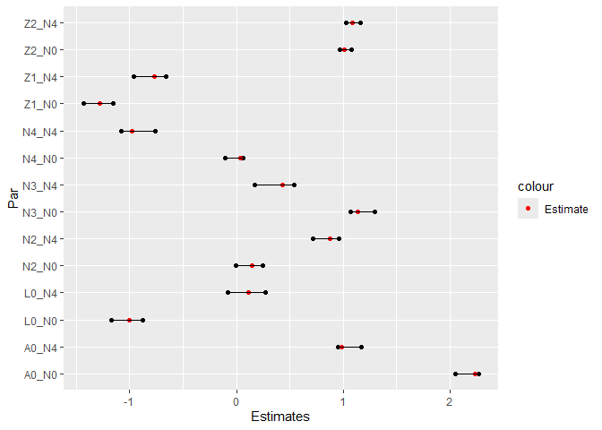
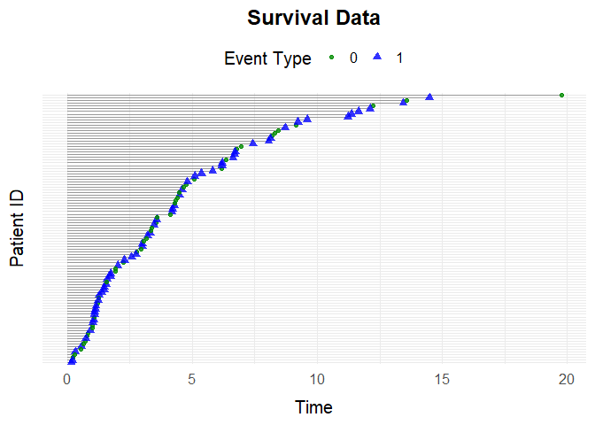

<!-- README.md is generated from README.Rmd. Please edit that file -->

# simevent

<!-- badges: start -->
<!-- badges: end -->

The goal of simevent is to provide functions for the generation and
analysis of complex continuous time health care data.

## Installation

You can install the development version of simevent from
[GitHub](https://github.com/) with:

``` r
# install.packages("pak")
pak::pak("miclukacova/simevent")
```

## Example 1: simEventData

The underlying function is called `simEventData`. One can specify
various arguments, as for example the `N` and `beta` argument. The
`N`argument lets the user specify number of individuals in the
simulation. The `beta` argument lets the user specify the effects of
processes and covariates on the intensities of the processes.

``` r
library(simevent)
# Number of individuals
N <- 100
# Effect on event 0 
beta0 <- c(0, 0, 0, 0)
# Effect on event 1
beta1 <- c(1, -1, 1, -1)
# Effect on event 2 (A)
beta2 <- c(0, -1, 0, 0.5)
# Effect on event 3 (L)
beta3 <- c(0, 0, 1, 0)
beta <- cbind(beta0, beta1, beta2, beta3)
```

And then call the function

``` r
data <- simEventData(N = N, beta = beta)
```

The simulated data looks like

``` r
head(data)
#> Key: <ID>
#>       ID      Time Delta       L0     L    A0     A
#>    <int>     <num> <num>    <num> <num> <int> <num>
#> 1:     1 1.8230751     0 33.69882     0     1     0
#> 2:     2 1.7713741     1 54.99243     0     0     0
#> 3:     3 0.7899128     3 39.05366     0     1     0
#> 4:     3 1.4684341     0 39.05366     1     1     0
#> 5:     4 2.3548280     3 62.78199     0     1     0
#> 6:     4 4.7450346     0 62.78199     1     1     0
```

One can visualize the data by

``` r
plotEventData(data)
```


## Example 2: Survival Data

You can simulate data from a survival setting with the function
`simSurvData`.

``` r
data <- simSurvData(100)
plotEventData(data, title = "Survival Data")
```


One can again specify the effects of $A_0$ and $L_0$ on the risk of
death and censoring by the `beta` argument.

``` r
# No effect of L0 and A0 on censoring process
beta_C <- c(0,0)
# Effect of L0 and A0 on death process
beta_D <- c(1,-1)

beta <- cbind(beta_C, beta_D)
```

And specify the parameters of the Weibull intensity for the censoring
and death process.

``` r
eta <- c(0.2, 0.2)
nu <- c(1.05, 1.05)
```

We now call the function and visualize the data

``` r
data <- simSurvData(100, beta = beta, eta = eta, nu = nu)
plotEventData(data, title = "Survival Data")
```


## Example 3: Competing Risk Data

You can simulate data from a competing risk setting with the function
`simCRdata`. The arguments `beta`, `eta`, `nu`, work in a similar maner
as above.

``` r
data <- simCRdata(100)
plotEventData(data, title = "Competing Risk Data")
```


## Example 4: Type 2 Diabetes

The function `simT2D` simulates health care data from a setting where
patients can experience $3$ different events: Censoring (0), Death (1)
and Type-2-Diabetes (2). The various arguments allow for the different
scenarios, and you can read about them on the help page

``` r
?simT2D
```

Below is a function call to `simT2D`

``` r
data <- simT2D(N = 100,
               sex = FALSE, 
               cens = 1,
               eta = c(0.1,0.3,0.1,0.1), 
               nu = c(1.1,1.3,1.1,1.1),
               beta_L0_L = 1, 
               beta_A0_L = -1.1, 
               beta_L_D = 1, 
               beta_L0_D = 0)

plotEventData(data, title = "T2D data")
```



## Example 5: Unobserved Covariate Setting

The `simConfounding` function was created to simulate data from a
setting where we have an unobserved confounding process. You can read
about the function on the help page

``` r
?simConfounding
```

One can simulate data from the default setting by the function call

``` r
data <- simConfounding(100)
```

And one can simulate from user specified scenarios by the function call

``` r
data <- simConfounding(N = 100,
                       beta_L_A = 1,
                       beta_L_D = 1,
                       beta_A_D = -1,
                       beta_A_L = -0.5,
                       beta_L0_A = 1,
                       eta = rep(0.1, 4),
                       nu = rep(1.1, 4),
                       followup = 5,
                       cens = 1,
                       op = 1)
```

For example the function call above simulates from a setting with the
operation/treatment event (op = 1), where there is a censoring process
(cens = 1), and where after 5 time units everybody is censored (followup
= 5). We can again visulize data by the function call to
`plotEventData`.

``` r
plotEventData(data, title = "Confounding setting")
```


