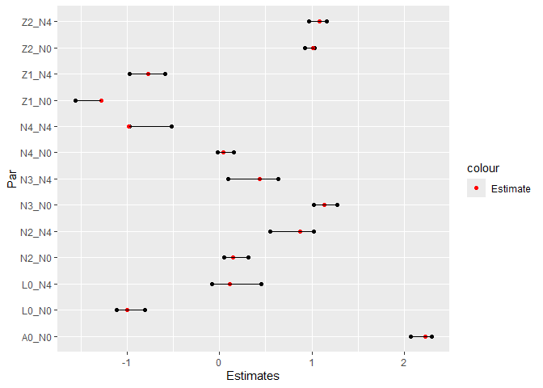
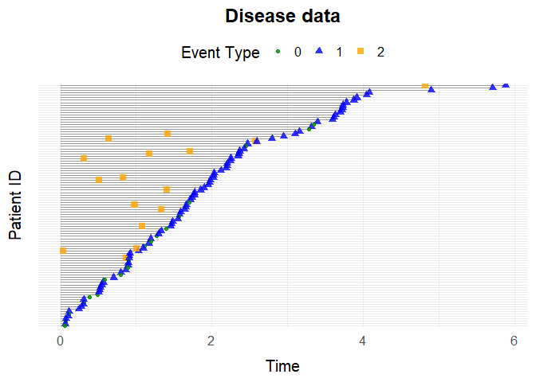
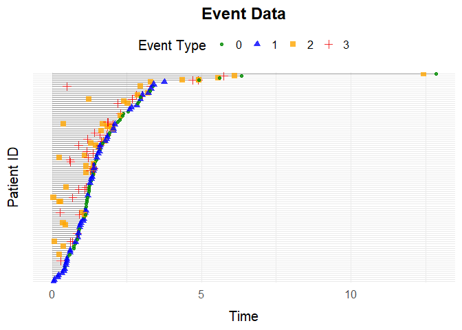

The simevent package
================

- [simevent](#simevent)
  - [Installation](#installation)
  - [Usage](#usage)
  - [Description](#description)
  - [Example 1: General Event History Simulation with
    `simEventData`](#example-1-general-event-history-simulation-with-simeventdata)
    - [Formatting Data for Cox
      Regression](#formatting-data-for-cox-regression)
    - [Visualize Event Histories](#visualize-event-histories)
    - [Using override_beta](#using-override_beta)
  - [Example 2: Survival Data with
    `simSurvData`](#example-2-survival-data-with-simsurvdata)
  - [Example 3: Competing Risk Data with
    `simCRdata`](#example-3-competing-risk-data-with-simcrdata)
  - [Example 4: Health Care Data with
    `simDisease`](#example-4-health-care-data-with-simdisease)
  - [Example 5: Health Care Data with
    `simTreatment`](#example-5-health-care-data-with-simtreatment)
  - [Example 6: Time Varying Effects with
    `simEventTV`](#example-6-time-varying-effects-with-simeventtv)
  - [Example 7: Simulating data from
    data](#example-7-simulating-data-from-data)
    - [Using `simEventCox`](#using-simeventcox)
    - [Using `simEventObj`](#using-simeventobj)
  - [Example 8: Interventions](#example-8-interventions)

# simevent

<!-- badges: start -->

<!-- badges: end -->

The `simevent` package provides tools for simulating and analyzing
complex continuous-time health care data.The simulated data includes
variables that can be interpreted as treatment decisions, disease
progression, and health factors.

## Installation

You can install the development version of `simevent` from
[GitHub](https://github.com/) with:

``` r
# install.packages("pak")
pak::pak("miclukacova/simevent")
```

## Usage

The package is loaded with the command

``` r
library(simevent)
```

## Description

One of the core functions is the flexible function `simEventData`, which
simulates from a Cox proportional hazards model with Weibull hazards.
Users can specify parameters and covariate effects to create custom
scenarios. In addition, the package offers several wrapper functions for
common settings (e.g., survival data, competing risks) built on top of
`simEventData`. The function `simEventTV` is an adaptation of the
function `simEventData`. It allows for time varying effects. This
feature results in a slightly slower simulation procedure, so when
possible `simEventData` is recommended.

Another branch of the package concerns simulating data from data. For
this the package has two functions, respectively `simEventCox` and
`simEventObj`. The first function takes as input Cox regressions and
simulates data using these, while the latter takes as input a general
model equipped with a `predict2` method.

Once data is simulated the package includes functions for plotting
(`plotEventData`) and formatting (`IntFormatData`).

One can perform interventions using the function `alphaSimDisease` and
calculate the effect of interventions using `intEffectAlphaDisease`.

Below is a table attempting to provide an overview of the package
functions. Each function in the package is described and an example is
provided.

**Functions relating to `simEventData`**

| Function | Description | Example | Example |
|----|----|----|----|
| `simEventData()` | Simulates event history data in the most general setting using Cox proportional hazard model and Weibull hazards. | `N`, `beta`, `eta`, `nu` | `simEventData(N = 5000)` |
| `simSurvData()` | Simulates survival data. | `N`, `beta`, `eta`, `nu`, `cens` | `simSurvData(N)` |
| `simCRdata()` | Simulates data from a competing risk setting with two competing causes. | `N`, `beta`, `eta`, `nu`, `cens` | `simCRdata(N)` |
| `simDisease()` | The function simulates health care data from a setting where patients can experience different events: Censoring, Death, Disease. The effects of the various process on one another can be specified by the arguments `beta_X_Y`. | `N`, `beta_L0_L` | `simDisease(N = 100, beta_L0_L = 1)` |
| `simTreatment()` | Simulates event history data with four types of events representing censoring (0), death (1), treatment (2), and covariate change (3). The effects of the various process on one another can be specified by the arguments `beta_X_Y`. | `N`, `beta_L_A` | `simTreatment(N = 100, beta_L_A = 1)` |
| `simDropIn()` | Simulates data corresponding to N individuals that are at risk for 4 or 5 events. Censoring (C), Death (D), Drop In Initiation (Z), Change in Covariate Process (L) and optionally Treatment (A). | `N`, `beta_L_A` | `simDropIn(N = 100, beta_L_A = 1)` |
| `simEventTV()` | Simulates general event history data in a setting with time-varying effects. | `N`, `beta`, `tv_eff`, `t_prime` | `simTreatment(N = 100, beta, tv_eff, t_prime)` |

**Functions for treating simulated data**

| Function | Description | Key Arguments | Example |
|----|----|----|----|
| `IntFormatData()` | Transforms data into a so called tstart-tstop format, used when fitting Cox proportional hazards using the `survival` package. | `data`, `N_cols` | `IntFormatData(data, N_cols = 8:12)` |
| `plotEventData()` | Plots the event histories. | `data`, `title` | `plotEventData(data)` |

**Functions relating to simulating from data**

| Function | Description | Key Arguments | Example |
|----|----|----|----|
| `simEventCox()` | Simulates new data using fitted Cox proportional hazard models | `N`, `cox_fits`, `L0_old`, `A0_old` | `simEventCox(N, cox_fits, L0_old, A0_old)` |
| `simEventObj()` | Simulates new data using a general model | `N`, `obj`, `list_old_vars` | `simEventObj(100, obj, list_old_vars = list_old_vars)` |

**Functions for performing interventions**

| Function | Description | Key Arguments | Example |
|----|----|----|----|
| `alphaSimDisease()` | Simulation and estimation of event history data from disease setting with shape parameter of disease process multiplied by alpha. | `N`, `alpha`, `tau`, `years_lost` | `alphaSimDisease(N = 10^4, alpha = 0.5, tau = 5, years_lost = FALSE)` |
| `alphaSimDropIn()` | Simulation and estimation of event history data from Drop In setting with shape parameter of Drop In process multiplied by alpha. | `N`, `alpha`, `tau`, `years_lost` | `alphaSimDropIn(N = 10, alpha = 0.5, tau = 5, years_lost = F)` |
| `alphaSimTreat()` | Simulation and estimation in treatment setting with modified shape parameter of treatment Process | `N`, `alpha`, `tau`, `years_lost` | `alphaSimTreat(N = 10, alpha = 0.5, tau = 5, years_lost = F)` |
| `intEffectAlphaDisease()` | Simulates data from the disease setting in two scenarios. Under intervention on the shape parameter  of the disease process is multiplied by , and a baseline (non-intervened) scenario.It computes the proportion of individuals who experience death or disease by a specified time  in the group , optionally returning years_lost. | `N`, `alpha`, `tau`, `years_lost` | `intEffectAlphaDisease(N = 10, alpha = 0.5, tau = 5, years_lost = F)` |
| `intEffectAlphaDropIn()` | Does the same as above, just in the Drop In setting. | `N`, `alpha`, `tau` | `intEffectAlphaDropIn(N = 10, alpha = 0.5, tau = 5)` |
| `intEffectAlphaTreat()` | Does the same as above, just in the Treatment setting. | `N`, `alpha`, `tau`, `years_lost` | `intEffectAlphaTreat(N = 10, alpha = 0.5, tau = 5, years_lost = F)` |

## Example 1: General Event History Simulation with `simEventData`

This is an example of simulating data using
`simEventData`.`simEventData` is a function for general event history
simulations. The function is quite flexible, and does therefore take
many arguments. You can read about the different arguments on the help
page

``` r
?simEventData
```

The number of simulated events corresponds to the length of the vectors
, , or the number of columns in .

Below, we create a 9x5 beta matrix for 5 event processes and 4 baseline
covariates:

``` r
set.seed(736)
beta <- matrix(rnorm(9*5), ncol = 5, nrow = 9)
```

You can add baseline covariates by supplying generator functions:

``` r
func1 <- function(N) rbinom(N, 1, 0.2)
func2 <- function(N) rnorm(N)
add_cov <- list("Z1" = func1, "Z2" = func2)
```

Define an function to specify risk windows for recurrent events:

``` r
# at risk function
at_risk <- function(events) {
  return(c(
    1,1,                         # Always at risk for event 0 and 1
    as.numeric(events[3] < 2),   # Event 2 can occur twice
    as.numeric(events[4] < 1),   # Event 3 can occur once
    as.numeric(events[5] < 2)))  # Event 4 can occur twice
}
```

Optionally one can define an function to specify risk windows as a
function of covariates:

``` r
# at risk function
at_risk_cov <- function(covariates) {
  return(c(
    1,1,                               # The covariates do not change the risk of event 0 and 1
    as.numeric(covariates[1] < 0.5),   # Only at risk of event 2 if L0 < 0.5
    as.numeric(covariates[2] == 1),    # Only at risk of event 3 if A0 = 1
    1))                                # The covariates do not change the risk of event 4
}
```

Simulate data for 5000 individuals:

``` r
set.seed(973)
data <- simEventData(N = 5000, beta = beta, add_cov = add_cov, at_risk = at_risk,
                     at_risk_cov = at_risk_cov)
```

Preview the simulated data:

``` r
head(data)
#> Key: <ID>
#>       ID      Time Delta        L0    A0    Z1         Z2    N0    N1    N2
#>    <int>     <num> <int>     <num> <num> <num>      <num> <num> <num> <num>
#> 1:     1 0.5067418     4 0.0482511     1     0  0.9036369     0     0     0
#> 2:     1 0.7741479     0 0.0482511     1     0  0.9036369     1     0     0
#> 3:     2 0.7952969     1 0.2186699     0     0  1.0631460     0     1     0
#> 4:     3 4.3490086     1 0.5021846     0     0 -0.2266280     0     1     0
#> 5:     4 0.1689083     0 0.4053148     1     0  1.2534397     1     0     0
#> 6:     5 1.5183445     3 0.3986500     1     0 -0.9204445     0     0     0
#>       N3    N4
#>    <num> <num>
#> 1:     0     1
#> 2:     0     1
#> 3:     0     0
#> 4:     0     0
#> 5:     0     0
#> 6:     1     0
```

### Formatting Data for Cox Regression

Transform the data into *tstart-tstop* format with `IntFormatData`
(specify columns with counting process data):

``` r
data_int <- IntFormatData(data, N_cols = 8:12)
head(data_int)
#>       ID      Time Delta        L0    A0    Z1         Z2    N0    N1    N2
#>    <int>     <num> <int>     <num> <num> <num>      <num> <num> <num> <num>
#> 1:     1 0.5067418     4 0.0482511     1     0  0.9036369     0     0     0
#> 2:     1 0.7741479     0 0.0482511     1     0  0.9036369     0     0     0
#> 3:     2 0.7952969     1 0.2186699     0     0  1.0631460     0     0     0
#> 4:     3 4.3490086     1 0.5021846     0     0 -0.2266280     0     0     0
#> 5:     4 0.1689083     0 0.4053148     1     0  1.2534397     0     0     0
#> 6:     5 1.5183445     3 0.3986500     1     0 -0.9204445     0     0     0
#>       N3    N4     k    tstart     tstop
#>    <num> <num> <int>     <num>     <num>
#> 1:     0     0     1 0.0000000 0.5067418
#> 2:     0     1     2 0.5067418 0.7741479
#> 3:     0     0     1 0.0000000 0.7952969
#> 4:     0     0     1 0.0000000 4.3490086
#> 5:     0     0     1 0.0000000 0.1689083
#> 6:     0     0     1 0.0000000 1.5183445
```

Fit Cox models for processes 0 and 4:

``` r
library(survival)

# Process 0
survfit0 <- coxph(Surv(tstart, tstop, Delta == 0) ~ L0 + A0 + Z1 + Z2 + N2 + N3 + N4, 
                  data = data_int)

# Process 4
survfit4 <- coxph(Surv(tstart, tstop, Delta == 4) ~ L0 + Z1 + Z2 + N2 + N3 + N4, 
                  data = data_int[(N4 < 2) & (A0 == 1)])
```

Visualize estimated coefficients alongside true values:

``` r
CIs <- cbind("Par" = c(paste0(rownames(confint(survfit0)), "_N0"), 
                       paste0(rownames(confint(survfit4)), "_N4")), 
             rbind(confint(survfit0), confint(survfit4)))

rownames(CIs) <- NULL
colnames(CIs) <- c("Par", "Lower", "Upper")
CIs <- data.table(CIs)
CIs[, True_val := c(beta[-c(5,6),1],
                    beta[-c(2,5,6),5])]

CIs$Lower <- as.numeric(CIs$Lower)
CIs$Upper <- as.numeric(CIs$Upper)

pp <- ggplot(data = CIs)+
  geom_point(aes(y = Par, x = Lower))+
  geom_point(aes(y = Par, x = Upper))+
  geom_point(aes(y = Par, x = True_val, col = "Estimate"))+
  scale_color_manual(values = c("Estimate" = "red"))+
  geom_segment(aes(y = Par, yend = Par, x = Lower, xend = Upper))+
  xlab("Estimates")
pp
```



### Visualize Event Histories

Plot the first 100 individuals’ event histories:

``` r
plotEventData(data[1:100,])
```


### Using override_beta

You can override specific entries in the beta matrix. For example, set
the effect of on processes and to zero:

``` r
data <- simEventData(N = 1000, beta = beta, add_cov = add_cov, at_risk = at_risk,
                     override_beta = list("L0" = c("N0" = 0, "N1" = 0)))
```

You can also specify non-linear effects, e.g., effect of on set to zero
if :

``` r
data <- simEventData(N = 1000, beta = beta, add_cov = add_cov, at_risk = at_risk,
                     override_beta = list("N2 > 1" = c("N1" = 2)))
```

Additionally the argument can be used to specify interaction effects,
e.g., if we want an interaction effect of 1 between L0 and N1 on N2 we
can specify the argument:

``` r
data <- simEventData(N = 1000, beta = beta, add_cov = add_cov, at_risk = at_risk,
                     override_beta =list("L0 * N1" = c("N2" = 1)))
```

## Example 2: Survival Data with `simSurvData`

The function simSurvData allows you to simulate survival data for
individuals at risk of both censoring (0) and an event (1).

By default, the function simulates survival data with no covariate
effects:

``` r
data <- simSurvData(100)
plotEventData(data, title = "Survival Data")
```


You can specify how baseline covariates and affect the risk of censoring
and death through the matrix. For example:

``` r
# Effects of L0 and A0 on the censoring hazard (first column)
beta_C <- c(0, 0)  

# Effects of L0 and A0 on the death hazard (second column)
beta_D <- c(1, -1)

# Combine into a 2x2 matrix where columns represent censoring and death hazards
beta <- cbind(beta_C, beta_D)
```

You can also set the Weibull shape () and scale () parameters for both
censoring and death hazards:

``` r
eta <- c(0.2, 0.2)
nu <- c(1.05, 1.05)
```

Use the specified parameters to simulate data and visualize it:

``` r
data <- simSurvData(100, beta = beta, eta = eta, nu = nu)
plotEventData(data, title = "Survival Data")
```


## Example 3: Competing Risk Data with `simCRdata`

Simulate competing risk data (similar parameters as above):

``` r
data <- simCRdata(100)
plotEventData(data, title = "Competing Risk Data")
```


## Example 4: Health Care Data with `simDisease`

The function `simDisease` simulates health care data from a setting
where patients can experience $3$ different events:

- **Censoring** (coded as 0)
- **Death** (coded as 1), and
- **Disease** (coded as 2).

You can customize the simulation scenarios by adjusting the function
arguments. For detailed information about the parameters, see the help
page.

Example simulation

``` r
data <- simDisease(N = 100,
               cens = 1,
               eta = c(0.1,0.3,0.1), 
               nu = c(1.1,1.3,1.1),
               beta_L0_L = 1, 
               beta_A0_L = -1.1, 
               beta_L_D = 1, 
               beta_L0_D = 0)

plotEventData(data, title = "Disease data")
```



## Example 5: Health Care Data with `simTreatment`

Simulate data with a covariate process and treatment process. Default
simulation:

``` r
data <- simTreatment(100)
```

Custom scenario:

``` r
data <- simTreatment(N = 100,
                       beta_L_A = 1,
                       beta_L_D = 1,
                       beta_A_D = -1,
                       beta_A_L = -0.5,
                       beta_L0_A = 1,
                       eta = rep(0.1, 4),
                       nu = rep(1.1, 4),
                       followup = 5,
                       cens = 1,
                       op = 1)
```

Plot

``` r
plotEventData(data, title = "Treatment setting")
```


## Example 6: Time Varying Effects with `simEventTV`

One can simulate a setting with time-varying effects with the function
`simEventTV`. After the time an additional effect of is added to the
beta matrix.

``` r
set.seed(6258)
eta <- rep(0.1, 4)
term_deltas <- c(0,1)
tv_eff <- matrix(0.5, ncol = 4, nrow = 6)
beta <- matrix(nrow = 6, ncol = 4, 0.5)
t_prime <- 1

data <- simEventTV(N = 100, t_prime = t_prime, tv_eff = tv_eff, eta = eta,
                   term_deltas = term_deltas, beta = beta, lower = 10^(-15), upper = 10^2,
                   max_events = 5)

plotEventData(data)
```



## Example 7: Simulating data from data

Imagine we have observed data:

``` r
set.seed(373)
beta = matrix(c(0.5,-1,-0.5,0.5,0,0.5), ncol = 3, nrow = 2)
data <- simCRdata(N = 1000, beta = beta)
```

### Using `simEventCox`

If we want to use `simEventCox` for simulating new data from the
observed data, we first need to fit Cox models:

``` r
cox1 <- coxph(Surv(Time, Delta == 1) ~ L0 + A0, data = data)
cox2 <- coxph(Surv(Time, Delta == 2) ~ L0 + A0, data = data)
```

Then we can call the function `simEventCox` providing the fitted Cox
models as arguments:

``` r
cox_fits <- list("Process 1" = cox1, "Process 2" = cox2)
new_data <- simEventCox(100, cox_fits, L0_old = data$L0, A0_old = data$A0)
```

The new simulated data looks like:

``` r
head(new_data)
#> Key: <ID>
#>       ID      Time Delta        L0    A0 Process 1 Process 2
#>    <int>     <num> <int>     <num> <num>     <num>     <num>
#> 1:     1  2.175382     1 0.5363954     0         1         0
#> 2:     2  7.139631     1 0.3144497     0         1         0
#> 3:     3  2.766344     1 0.9335247     1         1         0
#> 4:     4  3.570241     2 0.2502356     0         0         1
#> 5:     4 12.695609     1 0.2502356     0         1         1
#> 6:     5  5.055418     1 0.5462261     1         1         0
```

### Using `simEventObj`

If we want to use `simEventObj` for simulating new data from the
observed data, we need to fit a general model to data and equip it with
a `predict2` method. We can for example fit a random forest model using
`rfsrc` from the `randomForestSRC` package:

``` r
RF_fit <- randomForestSRC::rfsrc(Surv(Time, Delta) ~ L0 + A0, data = data)
```

Then we equip it with a `predict2` model

``` r
predict2 <- function(obj, ...) {
  UseMethod("predict2")
}

predict2.rfsrc <- function(obj, sim_data, ...){
  preds <- stats::predict(RF_fit, sim_data)
  list(time = preds$time.interest, chf = preds$chf)
}
```

Then we can call the function `simEventObj` providing the fitted Random
Forest as argument:

``` r
list_old_vars = list(L0 = data$L0, A0 = data$A0)
new_data <- simEventObj(100, RF_fit, list_old_vars = list_old_vars)
```

The new simulated data looks like:

``` r
head(new_data)
#> Key: <ID>
#>       ID     Time Delta         L0    A0    N1    N2
#>    <int>    <num> <int>      <num> <num> <num> <num>
#> 1:     1 1.169271     1 0.40253050     1     1     0
#> 2:     2 1.433632     2 0.80094849     0     0     1
#> 3:     3 6.062924     2 0.03707728     0     0     1
#> 4:     4 0.310825     1 0.84810211     1     1     0
#> 5:     5 1.465128     2 0.99071345     1     0     1
#> 6:     6 5.116592     2 0.98173073     1     0     1
```

## Example 8: Interventions

Say you want to perform an intervention in the Drop In setting by
scaling the intensity of one of your counting processes. Data without
intervention can be simulated by scaling with the factor 1:

``` r
alphaSim(N = 10^3, alpha = 1,  tau = 5, setting = "Drop In")
#> $effectDeath
#> [1] 0.09393346
#> 
#> $effectSetting
#> [1] 0.6731898
```

By default the function returns the proportion of individuals who
experience death and the proportion of individuals who experience Drop
In by a specified time in group . The user can specify what gets
returned by the function call with use of the arguments `years_lost` and
`return_data`. If the former is set to TRUE the function returns number
of years lost before of death and Drop In. If the latter is set to TRUE
the function call returns the simulated data.

To compare a non intervened scenario with a non intervened scenario, the
function `intEffectAlphaTreat` can be used. This function simulates data
from the Drop In setting in two scenarios. Under the intervention on the
shape parameter of the Drop In process, which is multiplied by , and a
baseline (non-intervened) scenario. It computes the proportion of
individuals who experience death or Drop In by a specified time in the
group , optionally returning years lost. The function can also plot a
sample of the event data for each scenario for comparison.

``` r
intEffectAlpha(N = 1000, alpha = 0.7, tau = 5, years_lost = TRUE, a0 = 1, plot = TRUE,
               setting = "Drop In")
#> $effect_2
#> [1] 1.498911
#> 
#> $effect_death
#> [1] 0.3070905
```
